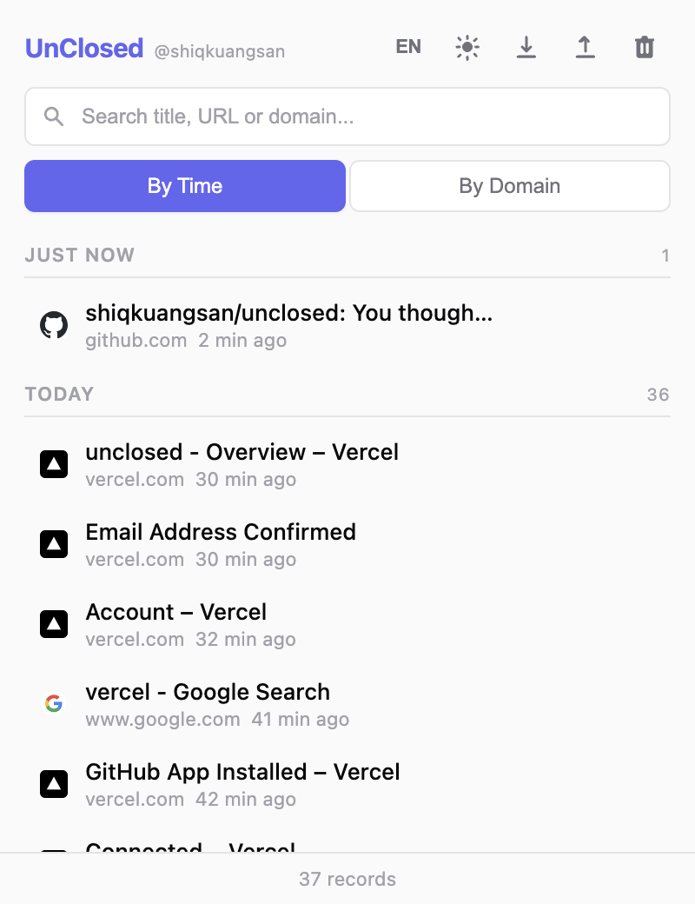
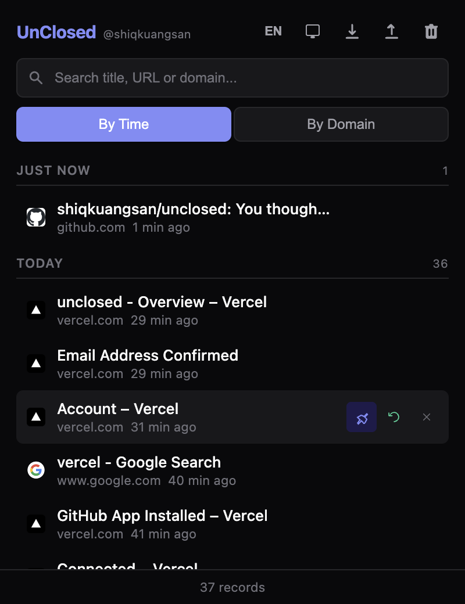

  

<h1 align="center">UnClosed</h1>

  <em>Every tab deserves a second chance.</em>

  
  
  

  <strong>English</strong> | <a href="README.zh-CN.md">中文</a>

  

## Features

- **Auto Capture** — Listens to all tab close events, records title, URL, favicon, and domain
- **Smart Grouping** — Group by time (Just now / Today / Yesterday / Earlier) or by domain
- **Batch Close Detection** — Tabs closed within a short window are grouped together with one-click restore
- **Search & Filter** — Real-time search by title, URL, or domain
- **Pin & Keep** — Pin important records to prevent auto-cleanup, pinned items stay on top with a visual indicator
- **Badge Count** — Icon badge shows today's closed tab count
- **Export / Import** — JSON format data export and import
- **Theme Switching** — Light / Dark / Follow System
- **i18n** — Chinese / English with manual toggle, defaults to browser language
- **Auto Cleanup** — Max 500 records, 30-day expiry (pinned records are exempt)

## Screenshots

| Light | Dark |
|:---:|:---:|
|  |  |

## Install

**Chrome Web Store** (under review)

<!-- TODO: Replace link after publishing -->
<!--  -->

**Manual Install**

1. Download or clone this repository
2. Open Chrome, navigate to `chrome://extensions/`
3. Enable "Developer mode" in the top right
4. Click "Load unpacked" and select this directory

## Tech Stack

- Chrome Extension Manifest V3
- Service Worker for background monitoring
- chrome.storage.local for persistence
- Vanilla JS + CSS, zero dependencies

## Privacy

UnClosed does not collect or transmit any user data. All data is stored locally on your device. See [Privacy Policy](PRIVACY.md) for details.

## License

[MIT](LICENSE) © 2026 [shiqkuangsan](https://github.com/shiqkuangsan)
