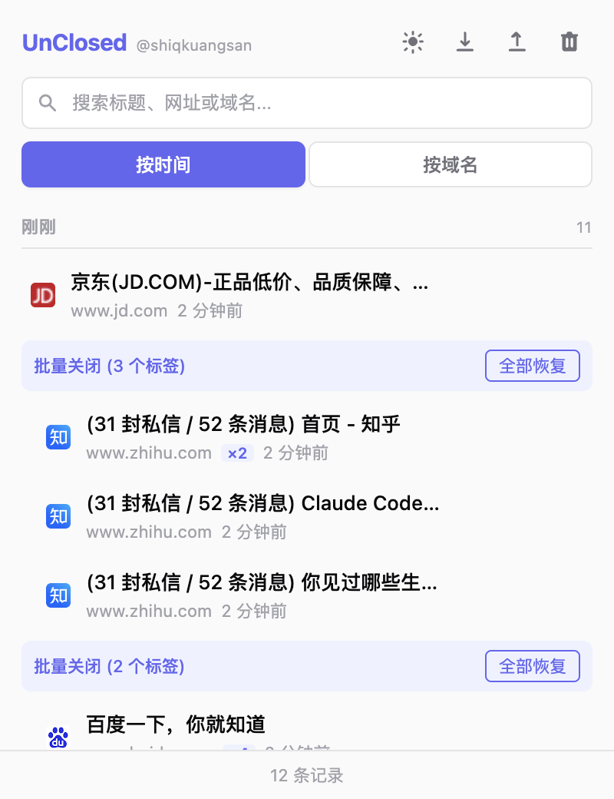
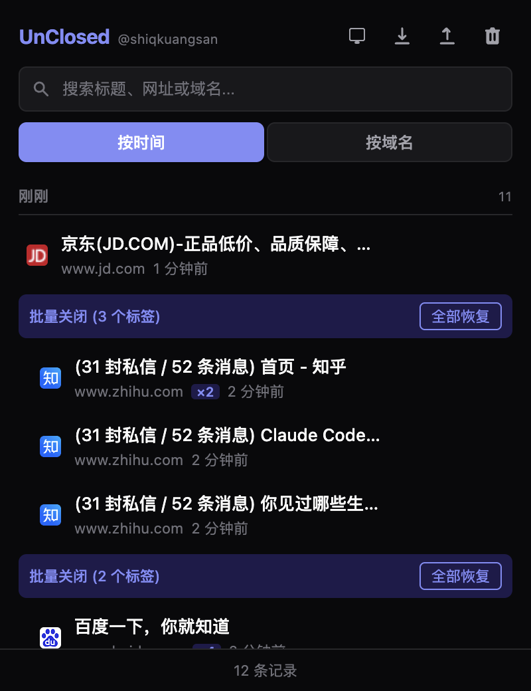
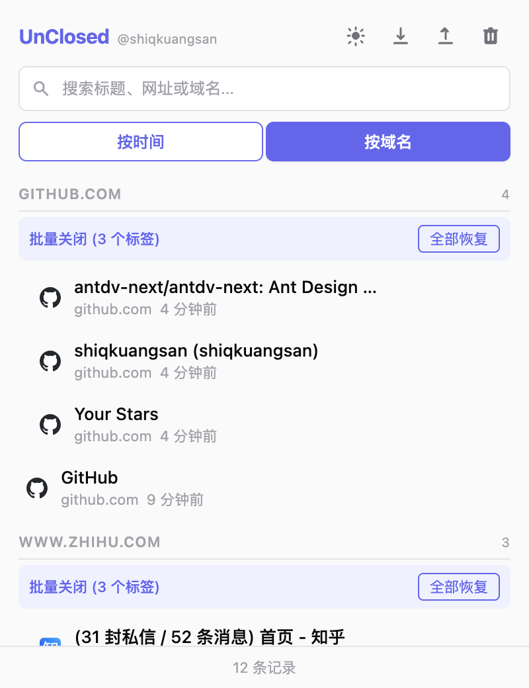

  

<h1 align="center">UnClosed</h1>

  <em>每个标签页，都值得第二次机会。</em>

  
  
  

  <a href="README.md">English</a> | <strong>中文</strong>

  

## 功能特性

- **自动捕获** — 监听所有标签关闭事件，自动记录标题、URL、favicon、域名
- **智能分组** — 按时间（刚刚 / 今天 / 昨天 / 更早）或按域名分组展示
- **批量关闭检测** — 短时间内关闭多个标签自动识别为一组，支持一键全部恢复
- **搜索过滤** — 按标题、URL、域名实时搜索
- **钉住收藏** — 重要记录可钉住，不会被自动清理
- **Badge 提示** — 图标角标显示今日关闭标签数量
- **导出 / 导入** — 支持 JSON 格式的数据导出和导入
- **主题切换** — 亮色 / 深色 / 跟随系统三种模式
- **自动清理** — 最多保留 500 条记录，30 天自动过期（已钉住的不受影响）

## 截图

| 亮色模式 | 深色模式 |
|:---:|:---:|
|  |  |
|  |  |

## 安装

**Chrome Web Store**（审核中）

<!-- TODO: 上架后替换链接 -->
<!--  -->

**手动安装**

1. 下载或 clone 本仓库
2. 打开 Chrome，访问 `chrome://extensions/`
3. 开启右上角「开发者模式」
4. 点击「加载已解压的扩展程序」，选择本目录

## 技术实现

- Chrome Extension Manifest V3
- Service Worker 后台监听
- chrome.storage.local 持久化
- 原生 JS + CSS，零依赖

## 隐私

UnClosed 不会收集或传输任何用户数据。所有数据均存储在您的本地设备上。详见 [隐私政策](PRIVACY.md)。

## 许可证

[MIT](LICENSE) © 2026 [shiqkuangsan](https://github.com/shiqkuangsan)
